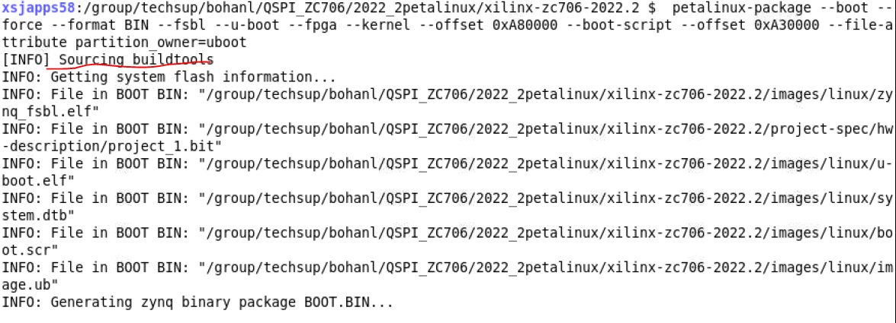
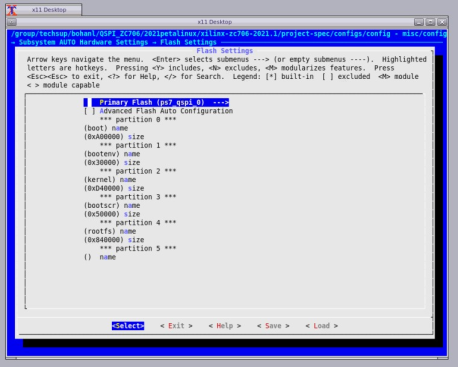
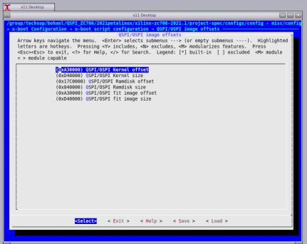
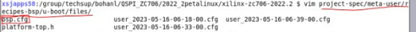
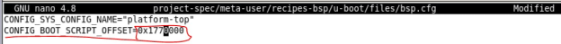
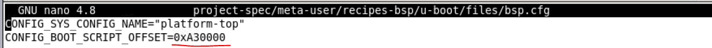
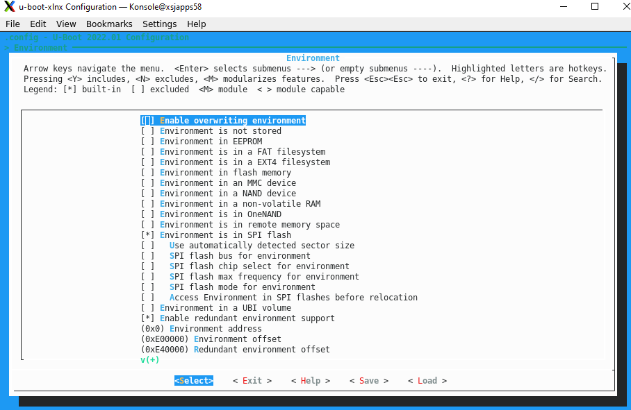
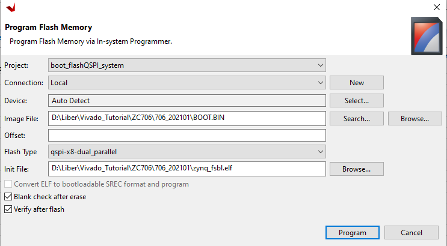
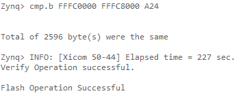

# zc706-QSPI-boot-image
How to boot QSPI images on a ZCU706 board using U-Boot distro boot

## **DESCRIPTION**
This Answer Record describes how to boot QSPI images on a ZCU706 board using U-Boot distro boot in 2022.2 of PetaLinux.

## **SOLUTION**
### 1. Create a PetaLinux project for a ZCU706 board using a template or BSP.

``` 
$ petalinux-create -t project -s <path_to_bsp>/xilinx-zc706-v2022.2-final.bsp
$ cd xilinx-zc706-2022.2

```
### 2. Configure the project with a QSPI partition.

#### (1)
If you cannot know the memory allocation in advance, you need to run the following command first, and allocate the flash space yourself according to the size of the project file of the build.

`$ petalinux-build`

Use petalinux-config to configure the flash space for each part of the files in images/linux/ in the project just generated.
**The size of the image file generated by different versions of petalinux may be different**
File correspondence as following:  
The flash memory of the whole zc706 development board is 32MB
- **BOOT.bin** includes：

|Files     |                                                      Size  |
|:---:|:---:|
|zynq_fsbl.elf     |                                                      502KB  |
|u-boot.elf         |                                                     7.2MB  |
|system.dtb            |                                                  26KB   | 

So we allocate **10MB** to BOOT.bin  

- **bootenv** :no file correspondence but still need the size of **0.2MB**   
- **Boot.scr** ：boot.scr                                        **0.3MB**
- **Image** includes：image.ub                                           **16.5MB**  


|Flash Partition Name|Partion Address|Partition Size|  
|:---:|:---:|:---:|   
|0~0xA00000  |                                 10MB          |                 boot|  
|0xA00000~0xA30000 |                小于0.2MB(0x30000)     |     bootenv|  
|0xA30000~0xA80000  |               大于0.3MB(0x50000)  |bootscr|  
|0xA80000~0x2000000 |                21MB左右(0x1580000)      | image(kernel)| 
  
**Attention：Kernel is behind bootscr.It depends on the package order.  The package order is as followings.**

#### (2)
finish the following steps:  
`$ petalinux-config ---> Subsystem AUTO Hardware Settings---> Flash Settings`

**Attention： Image is conresponding to kernel in the following image. The rootfs is useless in our project.**


### 3. Configure u-boot according to your own file.   
```$ petalinux-config ---> u-boot Configuration ---> u-boot script configuration ---> QSPI/OSPI image offsets```

- **Kernel** corresponds to **image**  
- **Fit image** according to the kernel to match the same as the **kernel** 
- **Attention**：The Ramdisk is respond to the rootfs ,and the rootfs is useless in our project.We don't need to configure it.



### 4.Configure the arm using the following steps  
#### (1)  
```
$ petalinux-config -c u-boot ---> ARM architecture ---> (0xA30000) Boot script offset
```
**If the modification cannot be saved, you need to manually modify the configuration file，as following**
project-spec/meta-user/recipes-bsp/u-boot/files/bsp.cfg  



#### (2)  
```
$ petalinux-config -c u-boot ---> Environment ---> [ ] Environment is not stored
$ petalinux-config -c u-boot ---> Environment ---> [*] Environment is in SPI flash
```



### 5.Pack the files to boot.BIN  

`$ petalinux-build`  

```
$ petalinux-package --boot --force --format BIN --fsbl --u-boot --fpga --kernel --offset 0xA80000 --boot-script --offset 0xA30000 --file-attribute partition_owner=uboot
```
## **Program Flash**
We use the software"Xilinx Vitis 2022.2".And we programming QSPI Flash with the Flash Programming Tool.If you want to learn more,please read the reference[5].  
1. Power on the ZC702 board in JTAG boot mode (SW16 = 00000).  

2. Select **Xilinx** → **Program Flash** in the Vitis IDE.

3. Set the Image File to the **BOOT.bin** file and the Init File to **<your board>fsbl.elf**.

4. Set the Flash Type to **qspi-x8-dual_parallel**.

5. Enable **Blank Check after Erase** and **Verify after flash**.

6. Select **Program**.  

  
  
### **Program Flash Successful Result**  

  
## **The serial port verifies whether the image is successful**
  - switch off your board.
  - After you program the QSPI Flash, set the SW16 switch on your board as shown in the following figure.  
  
  - Link the Uart serial cable and set the serial baud rate to 115200.
  - switch on you board.
  
  
### RESULT:The development board successfully finds the image through QSPI
```

 

U-Boot 2021.01 (Jun 01 2021 - 11:54:06 +0000)

 

CPU:   Zynq 7z045

Silicon: v3.1

Model: Zynq ZC706 Development Board

DRAM:  ECC disabled 1 GiB

Flash: 0 Bytes

NAND:  0 MiB

MMC:   mmc@e0100000: 0

Loading Environment from SPIFlash... SF: Detected s25fl128s with page size 512 Bytes, erase size 128 KiB, total 32 MiB

*** Warning - bad CRC, using default environment

 

In:    serial@e0001000

Out:   serial@e0001000

Err:   serial@e0001000

Net:

ZYNQ GEM: e000b000, mdio bus e000b000, phyaddr 7, interface rgmii-id

eth0: ethernet@e000b000

Hit any key to stop autoboot:  0

SF: Detected s25fl128s with page size 512 Bytes, erase size 128 KiB, total 32 MiB

device 0 offset 0x1770000, size 0x40000

SF: 262144 bytes @ 0x1770000 Read: OK

QSPI: Trying to boot script at 3000000

## Executing script at 03000000

Trying to load boot images from qspi

SF: Detected s25fl128s with page size 512 Bytes, erase size 128 KiB, total 32 MiB

device 0 offset 0xa30000, size 0xd40000

SF: 13893632 bytes @ 0xa30000 Read: OK

## Loading kernel from FIT Image at 10000000 ...

   Using 'conf-system-top.dtb' configuration

   Verifying Hash Integrity ... OK

   Trying 'kernel-1' kernel subimage

     Description:  Linux kernel

     Type:         Kernel Image

     Compression:  uncompressed

     Data Start:   0x100000f8

     Data Size:    4592000 Bytes = 4.4 MiB

     Architecture: ARM

     OS:           Linux

     Load Address: 0x00200000

     Entry Point:  0x00200000

     Hash algo:    sha256

     Hash value:   aaefc3c26eea46edd2596fb0ef9b1da687b9515fc274fb577acacf91c2197ad8

   Verifying Hash Integrity ... sha256+ OK

## Loading ramdisk from FIT Image at 10000000 ...

   Using 'conf-system-top.dtb' configuration

   Verifying Hash Integrity ... OK

   Trying 'ramdisk-1' ramdisk subimage

     Description:  petalinux-image-minimal

     Type:         RAMDisk Image

     Compression:  uncompressed

     Data Start:   0x10467864

     Data Size:    8384998 Bytes = 8 MiB

     Architecture: ARM

     OS:           Linux

     Load Address: unavailable

     Entry Point:  unavailable

     Hash algo:    sha256

     Hash value:   afbdee8168418ea8475292a6e33cb80dd1b3dea8370bd2d2220560108a9e2534

   Verifying Hash Integrity ... sha256+ OK

## Loading fdt from FIT Image at 10000000 ...

   Using 'conf-system-top.dtb' configuration

   Verifying Hash Integrity ... OK

   Trying 'fdt-system-top.dtb' fdt subimage

     Description:  Flattened Device Tree blob

     Type:         Flat Device Tree

     Compression:  uncompressed

     Data Start:   0x10461384

     Data Size:    25618 Bytes = 25 KiB

     Architecture: ARM

     Hash algo:    sha256

     Hash value:   cd7c8e80b678666dfa2b70004c40b072431bb6f8dbd3e0868600f3210809dfdb

   Verifying Hash Integrity ... sha256+ OK

   Booting using the fdt blob at 0x10461384

   Loading Kernel Image

   Loading Ramdisk to 2f800000, end 2ffff1e6 ... OK

   Loading Device Tree to 2f7f6000, end 2f7ff411 ... OK

 

Starting kernel ...

 

Booting Linux on physical CPU 0x0

Linux version 5.10.0-xilinx-v2021.1 (oe-user@oe-host) (arm-xilinx-linux-gnueabi-gcc (GCC) 10.2.0, GNU ld (GNU Binutils) 2.35.1) #1 SMP PREEMPT Fri Jun 4 15:57:16 UTC 2021

CPU: ARMv7 Processor [413fc090] revision 0 (ARMv7), cr=18c5387d

CPU: PIPT / VIPT nonaliasing data cache, VIPT aliasing instruction cache

OF: fdt: Machine model: Zynq ZC706 Development Board

earlycon: cdns0 at MMIO 0xe0001000 (options '115200n8')

printk: bootconsole [cdns0] enabled

Memory policy: Data cache writealloc

cma: Reserved 16 MiB at 0x3f000000

Zone ranges:

  Normal   [mem 0x0000000000000000-0x000000002fffffff]

  HighMem  [mem 0x0000000030000000-0x000000003fffffff]

Movable zone start for each node

Early memory node ranges

  node   0: [mem 0x0000000000000000-0x000000003fffffff]

Initmem setup node 0 [mem 0x0000000000000000-0x000000003fffffff]

percpu: Embedded 15 pages/cpu s32332 r8192 d20916 u61440

Built 1 zonelists, mobility grouping on.  Total pages: 260416

Kernel command line: console=ttyPS0,115200 earlycon root=/dev/ram0 rw

Dentry cache hash table entries: 131072 (order: 7, 524288 bytes, linear)

Inode-cache hash table entries: 65536 (order: 6, 262144 bytes, linear)

mem auto-init: stack:off, heap alloc:off, heap free:off

Memory: 1001572K/1048576K available (7168K kernel code, 270K rwdata, 1872K rodata, 1024K init, 161K bss, 30620K reserved, 16384K cma-reserved, 245760K highmem)

rcu: Preemptible hierarchical RCU implementation.

rcu:    RCU event tracing is enabled.

rcu:    RCU restricting CPUs from NR_CPUS=4 to nr_cpu_ids=2.

        Trampoline variant of Tasks RCU enabled.

rcu: RCU calculated value of scheduler-enlistment delay is 10 jiffies.

rcu: Adjusting geometry for rcu_fanout_leaf=16, nr_cpu_ids=2

NR_IRQS: 16, nr_irqs: 16, preallocated irqs: 16

efuse mapped to (ptrval)

slcr mapped to (ptrval)

GIC physical location is 0xf8f01000

L2C: platform modifies aux control register: 0x72360000 -> 0x72760000

L2C: DT/platform modifies aux control register: 0x72360000 -> 0x72760000

L2C-310 erratum 769419 enabled

L2C-310 enabling early BRESP for Cortex-A9

L2C-310 full line of zeros enabled for Cortex-A9

L2C-310 ID prefetch enabled, offset 1 lines

L2C-310 dynamic clock gating enabled, standby mode enabled

L2C-310 cache controller enabled, 8 ways, 512 kB

L2C-310: CACHE_ID 0x410000c8, AUX_CTRL 0x76760001

random: get_random_bytes called from start_kernel+0x2c0/0x4a0 with crng_init=0

zynq_clock_init: clkc starts at (ptrval)

Zynq clock init

sched_clock: 64 bits at 333MHz, resolution 3ns, wraps every 4398046511103ns

clocksource: arm_global_timer: mask: 0xffffffffffffffff max_cycles: 0x4ce07af025, max_idle_ns: 440795209040 ns

Switching to timer-based delay loop, resolution 3ns

Console: colour dummy device 80x30

Calibrating delay loop (skipped), value calculated using timer frequency.. 666.66 BogoMIPS (lpj=3333333)

pid_max: default: 32768 minimum: 301

Mount-cache hash table entries: 2048 (order: 1, 8192 bytes, linear)

Mountpoint-cache hash table entries: 2048 (order: 1, 8192 bytes, linear)

CPU: Testing write buffer coherency: ok

CPU0: Spectre v2: using BPIALL workaround

CPU0: thread -1, cpu 0, socket 0, mpidr 80000000

Setting up static identity map for 0x100000 - 0x100060

rcu: Hierarchical SRCU implementation.

smp: Bringing up secondary CPUs ...

CPU1: thread -1, cpu 1, socket 0, mpidr 80000001

CPU1: Spectre v2: using BPIALL workaround

smp: Brought up 1 node, 2 CPUs

SMP: Total of 2 processors activated (1333.33 BogoMIPS).

CPU: All CPU(s) started in SVC mode.

devtmpfs: initialized

VFP support v0.3: implementor 41 architecture 3 part 30 variant 9 rev 4

clocksource: jiffies: mask: 0xffffffff max_cycles: 0xffffffff, max_idle_ns: 19112604462750000 ns

futex hash table entries: 512 (order: 3, 32768 bytes, linear)

pinctrl core: initialized pinctrl subsystem

NET: Registered protocol family 16

DMA: preallocated 256 KiB pool for atomic coherent allocations

thermal_sys: Registered thermal governor 'step_wise'

cpuidle: using governor menu

hw-breakpoint: found 5 (+1 reserved) breakpoint and 1 watchpoint registers.

hw-breakpoint: maximum watchpoint size is 4 bytes.

zynq-ocm f800c000.ocmc: ZYNQ OCM pool: 256 KiB @ 0x(ptrval)

vgaarb: loaded

SCSI subsystem initialized

usbcore: registered new interface driver usbfs

usbcore: registered new interface driver hub

usbcore: registered new device driver usb

mc: Linux media interface: v0.10

videodev: Linux video capture interface: v2.00

pps_core: LinuxPPS API ver. 1 registered

pps_core: Software ver. 5.3.6 - Copyright 2005-2007 Rodolfo Giometti <giometti@linux.it>

PTP clock support registered

EDAC MC: Ver: 3.0.0

FPGA manager framework

Advanced Linux Sound Architecture Driver Initialized.

clocksource: Switched to clocksource arm_global_timer

NET: Registered protocol family 2

tcp_listen_portaddr_hash hash table entries: 512 (order: 0, 6144 bytes, linear)

TCP established hash table entries: 8192 (order: 3, 32768 bytes, linear)

TCP bind hash table entries: 8192 (order: 4, 65536 bytes, linear)

TCP: Hash tables configured (established 8192 bind 8192)

UDP hash table entries: 512 (order: 2, 16384 bytes, linear)

UDP-Lite hash table entries: 512 (order: 2, 16384 bytes, linear)

NET: Registered protocol family 1

RPC: Registered named UNIX socket transport module.

RPC: Registered udp transport module.

RPC: Registered tcp transport module.

RPC: Registered tcp NFSv4.1 backchannel transport module.

PCI: CLS 0 bytes, default 64

Trying to unpack rootfs image as initramfs...

Freeing initrd memory: 8192K

hw perfevents: no interrupt-affinity property for /pmu@f8891000, guessing.

hw perfevents: enabled with armv7_cortex_a9 PMU driver, 7 counters available

workingset: timestamp_bits=14 max_order=18 bucket_order=4

jffs2: version 2.2. (NAND) (SUMMARY)  © 2001-2006 Red Hat, Inc.

bounce: pool size: 64 pages

io scheduler mq-deadline registered

io scheduler kyber registered

zynq-pinctrl 700.pinctrl: zynq pinctrl initialized

dma-pl330 f8003000.dmac: Loaded driver for PL330 DMAC-241330

dma-pl330 f8003000.dmac:        DBUFF-128x8bytes Num_Chans-8 Num_Peri-4 Num_Events-16

brd: module loaded

loop: module loaded

spi-nor spi0.0: found s25fl128s1, expected n25q128a11

random: fast init done

random: crng init done

spi-nor spi0.0: trying to lock already unlocked area

spi-nor spi0.0: s25fl128s1 (32768 Kbytes)

5 fixed-partitions partitions found on MTD device spi0.0

Creating 5 MTD partitions on "spi0.0":

0x000000000000-0x000000a00000 : "boot"

0x000000c00000-0x000001000000 : "qspi-bitstream"

0x000000a00000-0x000000a30000 : "bootenv"

mtd: partition "bootenv" doesn't end on an erase/write block -- force read-only

0x000000a30000-0x000001770000 : "kernel"

mtd: partition "kernel" doesn't start on an erase/write block boundary -- force read-only

0x000001770000-0x0000017c0000 : "bootscr"

mtd: partition "bootscr" doesn't start on an erase/write block boundary -- force read-only

libphy: Fixed MDIO Bus: probed

CAN device driver interface

libphy: MACB_mii_bus: probed

macb e000b000.ethernet eth0: Cadence GEM rev 0x00020118 at 0xe000b000 irq 35 (00:0a:35:00:1e:53)

e1000e: Intel(R) PRO/1000 Network Driver

e1000e: Copyright(c) 1999 - 2015 Intel Corporation.

ehci_hcd: USB 2.0 'Enhanced' Host Controller (EHCI) Driver

ehci-pci: EHCI PCI platform driver

usbcore: registered new interface driver usb-storage

ULPI transceiver vendor/product ID 0x0424/0x0007

Found SMSC USB3320 ULPI transceiver.

ULPI integrity check: passed.

ci_hdrc ci_hdrc.0: EHCI Host Controller

ci_hdrc ci_hdrc.0: new USB bus registered, assigned bus number 1

ci_hdrc ci_hdrc.0: USB 2.0 started, EHCI 1.00

hub 1-0:1.0: USB hub found

hub 1-0:1.0: 1 port detected

i2c /dev entries driver

cdns-i2c e0004000.i2c: 400 kHz mmio e0004000 irq 30

si570 1-005d: registered, current frequency 148500000 Hz

i2c i2c-0: Added multiplexed i2c bus 1

i2c i2c-0: Added multiplexed i2c bus 2

at24 3-0054: supply vcc not found, using dummy regulator

at24 3-0054: 1024 byte 24c08 EEPROM, writable, 1 bytes/write

i2c i2c-0: Added multiplexed i2c bus 3

i2c i2c-0: Added multiplexed i2c bus 4

rtc-pcf8563 5-0051: low voltage detected, date/time is not reliable.

rtc-pcf8563 5-0051: registered as rtc0

rtc-pcf8563 5-0051: low voltage detected, date/time is not reliable.

rtc-pcf8563 5-0051: hctosys: unable to read the hardware clock

i2c i2c-0: Added multiplexed i2c bus 5

i2c i2c-0: Added multiplexed i2c bus 6

i2c i2c-0: Added multiplexed i2c bus 7

i2c i2c-0: Added multiplexed i2c bus 8

pca954x 0-0074: registered 8 multiplexed busses for I2C switch pca9548

ucd9000 8-0065: Device ID UCD90120A|2.3.4.0000|110603

cdns-wdt f8005000.watchdog: Xilinx Watchdog Timer with timeout 10s

EDAC MC: ECC not enabled

Xilinx Zynq CpuIdle Driver started

sdhci: Secure Digital Host Controller Interface driver

sdhci: Copyright(c) Pierre Ossman

sdhci-pltfm: SDHCI platform and OF driver helper

ledtrig-cpu: registered to indicate activity on CPUs

clocksource: ttc_clocksource: mask: 0xffff max_cycles: 0xffff, max_idle_ns: 537538477 ns

timer #0 at 69b1a251, irq=48

usbcore: registered new interface driver usbhid

usbhid: USB HID core driver

fpga_manager fpga0: Xilinx Zynq FPGA Manager registered

NET: Registered protocol family 10

mmc0: SDHCI controller on e0100000.mmc [e0100000.mmc] using ADMA

Segment Routing with IPv6

sit: IPv6, IPv4 and MPLS over IPv4 tunneling driver

NET: Registered protocol family 17

can: controller area network core

NET: Registered protocol family 29

can: raw protocol

can: broadcast manager protocol

can: netlink gateway - max_hops=1

Registering SWP/SWPB emulation handler

e0001000.serial: ttyPS0 at MMIO 0xe0001000 (irq = 33, base_baud = 3125000) is a xuartps

printk: console [ttyPS0] enabled

printk: console [ttyPS0] enabled

printk: bootconsole [cdns0] disabled

printk: bootconsole [cdns0] disabled

of-fpga-region fpga-full: FPGA Region probed

of_cfs_init

of_cfs_init: OK

ALSA device list:

  No soundcards found.

Freeing unused kernel memory: 1024K

Run /init as init process

INIT: version 2.97 booting

Starting udev

udevd[69]: starting version 3.2.9

udevd[70]: starting eudev-3.2.9

rtc-pcf8563 5-0051: low voltage detected, date/time is not reliable.

macb e000b000.ethernet eth0: PHY [e000b000.ethernet-ffffffff:07] driver [Marvell 88E1116R] (irq=POLL)

macb e000b000.ethernet eth0: configuring for phy/rgmii-id link mode

Starting tcf-agent: OK

root@xilinx-zc706-2021_1:~#

```
## **REFERENCE**
[1]PetaLinux Tools Documentation: Reference Guide (UG1144) （https://docs.xilinx.com/r/en-US/ug1144-petalinux-tools-reference-guide/Steps-to-Boot-a-PetaLinux-Image-on-Hardware-with-QSPI-or-OSPI）  
[2]Zynq MPSoC - How to prepare a QSPI boot image to use with the default boot.scr method with PetaLinux(https://support.xilinx.com/s/article/1276990?language=en_US)  
[3]2020.x-2021.x and later PetaLinux: How to boot QSPI images on a ZCU102 board using U-Boot distro boot(https://support.xilinx.com/s/article/000033588?language=en_US)   
[4]下载开发板bsp文件（https://xilinx-wiki.atlassian.net/wiki/spaces/A/pages/1884029195/2021.1+Release）  
[5]Program Flash in Example 10(https://xilinx.github.io/Embedded-Design-Tutorials/docs/2020.2/build/html/docs/Introduction/Zynq7000-EDT/7-linux-booting-debug.html)
 


