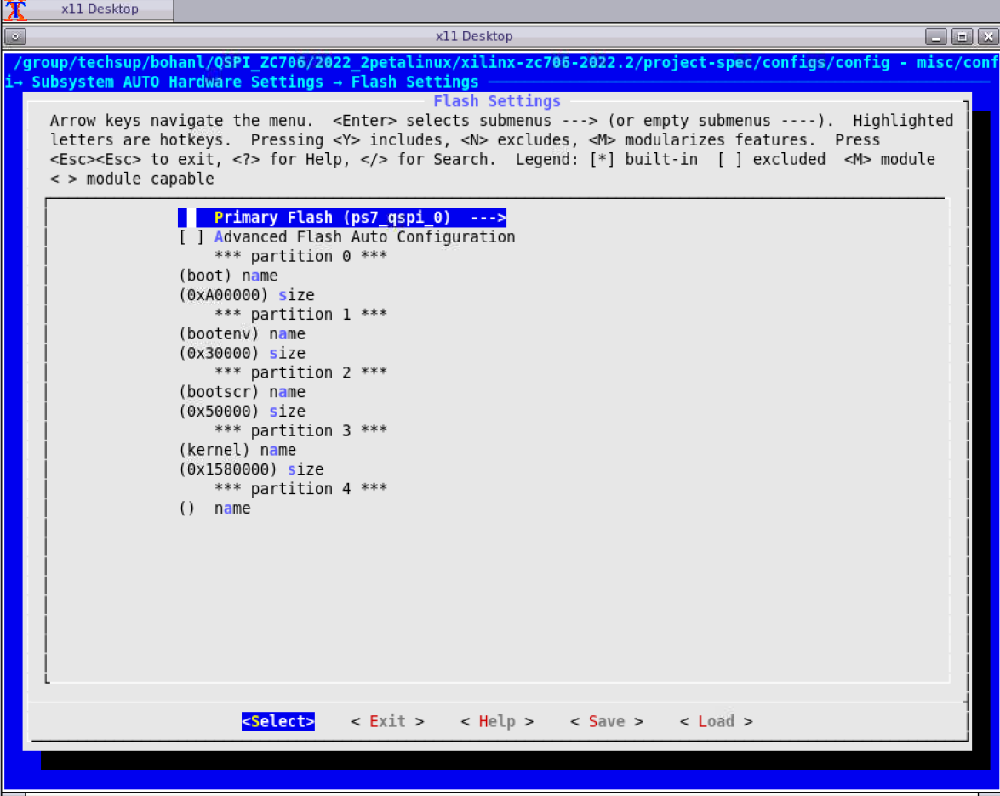
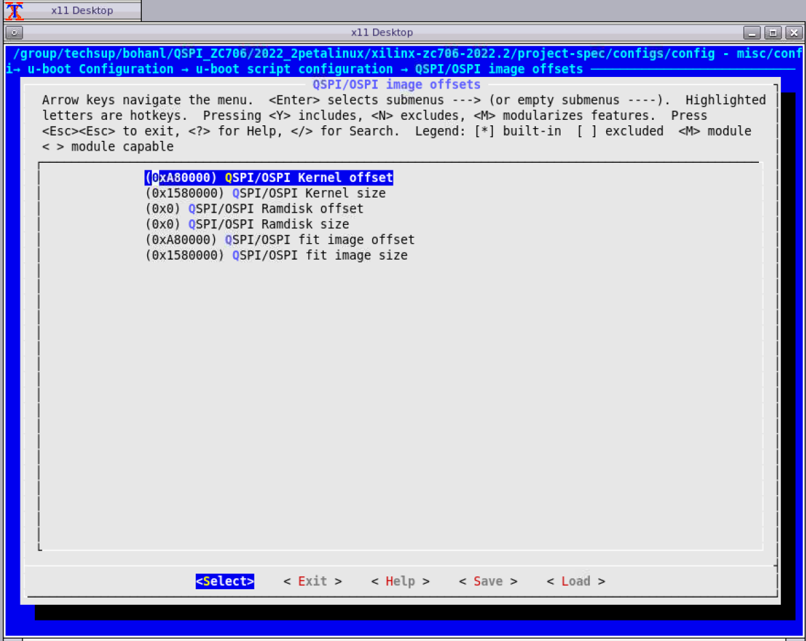

# zc706-QSPI-boot-image
How to boot QSPI images on a ZCU706 board using U-Boot distro boot

## **DESCRIPTION**
This Answer Record describes how to boot QSPI images on a ZCU706 board using U-Boot distro boot in 2022.2 of PetaLinux.

## **Differences from petalinux version 202101**
- In solution step4,we may not use `$ petalinux-config -c u-boot ---> ARM architecture ---> (0xA30000) Boot script offset` to configure the offset. We need to config it in bsp.cfg. For details, see solution step 4.

- We need to configure the enviroment of u-boot.For details,see solution step 4.

- The size of the image files generated by petealinux2022 is different from that of the 2021 version.For details,see solution step 2.

- According to the package order, the address offset of the kernel should be behind the bootscr.

## **SOLUTION**
### 1. Create a PetaLinux project for a ZCU706 board using a template or BSP.

``` 
$ petalinux-create -t project -s <path_to_bsp>/xilinx-zc706-v2022.2-final.bsp
$ cd xilinx-zc706-2022.2

```
### 2. Configure the project with a QSPI partition.

#### (1)If you cannot know the memory allocation in advance, you need to run the following command first, and allocate the flash space yourself according to the size of the project file of the build.

`$ petalinux-build`

Use petalinux-config to configure the flash space for each part of the files in images/linux/ in the project just generated.
**The size of the image file generated by different versions of petalinux may be different**
File correspondence as following:  
The flash memory of the whole zc706 development board is 32MB
- **BOOT.bin** includes：

|Files     |                                                      Size  |
|:---:|:---:|
|zynq_fsbl.elf     |                                                      502KB  |
|u-boot.elf         |                                                     7.2MB  |
|system.dtb            |                                                  26KB   | 

So we allocate **10MB** to BOOT.bin  

- **bootenv** :no file correspondence but still need the size of **0.2MB**   
- **Boot.scr** ：boot.scr                                        **0.3MB**
- **Image** includes：image.ub                                           **16.5MB**  


|Flash Partition Name|Partion Address|Partition Size|  
|:---:|:---:|:---:|   
|0~0xA00000  |                                 10MB          |                 boot|  
|0xA00000~0xA30000 |                less than 0.2MB(0x30000)     |     bootenv|  
|0xA30000~0xA80000  |               greater than0.3MB(0x50000)  |bootscr|  
|0xA80000~0x2000000 |                nearly 21MB(0x1580000)      | image(kernel)| 
  
**Attention：Kernel is behind bootscr.It depends on the package order.  The package order is as followings.**

#### (2)finish the following steps:  
`$ petalinux-config ---> Subsystem AUTO Hardware Settings---> Flash Settings`

**Attention： Image is conresponding to kernel in the following image. The rootfs is useless in our project.**


### 3. Configure u-boot according to your own file.   
```$ petalinux-config ---> u-boot Configuration ---> u-boot script configuration ---> QSPI/OSPI image offsets```

- **Kernel** corresponds to **image**  
- **Fit image** according to the kernel to match the same as the **kernel** 
- **Attention**：The Ramdisk is respond to the rootfs ,and the rootfs is useless in our project.We don't need to configure it.



### 4.Configure the arm using the following steps  
#### (1)  
```
$ petalinux-config -c u-boot ---> ARM architecture ---> (0xA30000) Boot script offset
```
**If the modification cannot be saved, you need to manually modify the configuration file，as following**
project-spec/meta-user/recipes-bsp/u-boot/files/bsp.cfg  


#### (2)  
```
$ petalinux-config -c u-boot ---> Environment ---> [ ] Environment is not stored
$ petalinux-config -c u-boot ---> Environment ---> [*] Environment is in SPI flash
```


### 5.Pack the files to boot.BIN  

`$ petalinux-build`  

```
$ petalinux-package --boot --force --format BIN --fsbl --u-boot --fpga --kernel --offset 0xA80000 --boot-script --offset 0xA30000 --file-attribute partition_owner=uboot
```
## **Program Flash**
We use the software"Xilinx Vitis 2022.2".And we programming QSPI Flash with the Flash Programming Tool.If you want to learn more,please read the reference[5].  
1. Power on the ZC702 board in JTAG boot mode (SW16 = 00000).  

2. Select **Xilinx** → **Program Flash** in the Vitis IDE.

3. Set the Image File to the **BOOT.bin** file and the Init File to **<your board>fsbl.elf**.

4. Set the Flash Type to **qspi-x8-dual_parallel**.

5. Enable **Blank Check after Erase** and **Verify after flash**.

6. Select **Program**.  

  
  
### **Program Flash Successful Result**  

  
## **The serial port verifies whether the image is successful**
  - switch off your board.
  - After you program the QSPI Flash, set the SW16 switch on your board as shown in the following figure.  
  
  - Link the Uart serial cable and set the serial baud rate to 115200.
  - switch on you board.
  
  
### RESULT:The development board successfully finds the image through QSPI
```

U-Boot 2022.01-00194-gb31476685d (Sep 20 2022 - 06:35:33 +0000)

CPU:   Zynq 7z045
Silicon: v3.1
Model: Zynq ZC706 Development Board
DRAM:  ECC disabled 1 GiB
Flash: 0 Bytes
NAND:  0 MiB
MMC:   mmc@e0100000: 0
Loading Environment from SPIFlash... SF: Detected s25fl128s with page size 512 Bytes, erase size 128 KiB, total 32 MiB
*** Warning - bad CRC, using default environment

In:    serial@e0001000
Out:   serial@e0001000
Err:   serial@e0001000
Net:   FEC: can't find phy-handle

ZYNQ GEM: e000b000, mdio bus e000b000, phyaddr 7, interface rgmii-id
eth0: ethernet@e000b000
Hit any key to stop autoboot:  0
SF: Detected s25fl128s with page size 512 Bytes, erase size 128 KiB, total 32 MiB
device 0 offset 0xa30000, size 0x40000
SF: 262144 bytes @ 0xa30000 Read: OK
QSPI: Trying to boot script at 3000000
## Executing script at 03000000
Trying to load boot images from qspi
SF: Detected s25fl128s with page size 512 Bytes, erase size 128 KiB, total 32 MiB
device 0 offset 0xa80000, size 0x1580000
SF: 22544384 bytes @ 0xa80000 Read: OK
## Loading kernel from FIT Image at 10000000 ...
   Using 'conf-system-top.dtb' configuration
   Verifying Hash Integrity ... OK
   Trying 'kernel-1' kernel subimage
     Description:  Linux kernel
     Type:         Kernel Image
     Compression:  uncompressed
     Data Start:   0x100000fc
     Data Size:    4545080 Bytes = 4.3 MiB
     Architecture: ARM
     OS:           Linux
     Load Address: 0x00200000
     Entry Point:  0x00200000
     Hash algo:    sha256
     Hash value:   2f4bd8b620f83c554b527ccdf0853c82a599c9d1323680bc632be8dc677f3795
   Verifying Hash Integrity ... sha256+ OK
## Loading ramdisk from FIT Image at 10000000 ...
   Using 'conf-system-top.dtb' configuration
   Verifying Hash Integrity ... OK
   Trying 'ramdisk-1' ramdisk subimage
     Description:  petalinux-image-minimal
     Type:         RAMDisk Image
     Compression:  uncompressed
     Data Start:   0x1045c0fc
     Data Size:    12277661 Bytes = 11.7 MiB
     Architecture: ARM
     OS:           Linux
     Load Address: unavailable
     Entry Point:  unavailable
     Hash algo:    sha256
     Hash value:   a9ad2101e042bd21b8010748687f8cb59ba79468b67f847a98fb0aa398c5116b
   Verifying Hash Integrity ... sha256+ OK
## Loading fdt from FIT Image at 10000000 ...
   Using 'conf-system-top.dtb' configuration
   Verifying Hash Integrity ... OK
   Trying 'fdt-system-top.dtb' fdt subimage
     Description:  Flattened Device Tree blob
     Type:         Flat Device Tree
     Compression:  uncompressed
     Data Start:   0x10455c40
     Data Size:    25582 Bytes = 25 KiB
     Architecture: ARM
     Hash algo:    sha256
     Hash value:   553f4bebee4bc9dda8cdd8aab3c87cfc9beb7fdf49c1de3a8daab8b09d07cce8
   Verifying Hash Integrity ... sha256+ OK
   Booting using the fdt blob at 0x10455c40
   Loading Kernel Image
   Loading Ramdisk to 2f44a000, end 2ffff79d ... OK
   Loading Device Tree to 2f440000, end 2f4493ed ... OK

Starting kernel ...

Booting Linux on physical CPU 0x0
Linux version 5.15.36-xilinx-v2022.2 (oe-user@oe-host) (arm-xilinx-linux-gnueabi-gcc (GCC) 11.2.0, GNU ld (GNU Binutils) 2.37.20210721) #1 SMP PREEMPT Mon Oct 3 07:50:07 UTC 2022
CPU: ARMv7 Processor [413fc090] revision 0 (ARMv7), cr=18c5387d
CPU: PIPT / VIPT nonaliasing data cache, VIPT aliasing instruction cache
OF: fdt: Machine model: Zynq ZC706 Development Board
earlycon: cdns0 at MMIO 0xe0001000 (options '115200n8')
printk: bootconsole [cdns0] enabled
Memory policy: Data cache writealloc
cma: Reserved 16 MiB at 0x3f000000
Zone ranges:
  Normal   [mem 0x0000000000000000-0x000000002fffffff]
  HighMem  [mem 0x0000000030000000-0x000000003fffffff]
Movable zone start for each node
Early memory node ranges
  node   0: [mem 0x0000000000000000-0x000000003fffffff]
Initmem setup node 0 [mem 0x0000000000000000-0x000000003fffffff]
percpu: Embedded 12 pages/cpu s16588 r8192 d24372 u49152
Built 1 zonelists, mobility grouping on.  Total pages: 260608
Kernel command line: console=ttyPS0,115200 earlycon root=/dev/ram0 rw
Dentry cache hash table entries: 131072 (order: 7, 524288 bytes, linear)
Inode-cache hash table entries: 65536 (order: 6, 262144 bytes, linear)
mem auto-init: stack:off, heap alloc:off, heap free:off
Memory: 998880K/1048576K available (7168K kernel code, 244K rwdata, 1896K rodata, 1024K init, 123K bss, 33312K reserved, 16384K cma-reserved, 245760K highmem)
rcu: Preemptible hierarchical RCU implementation.
rcu:    RCU event tracing is enabled.
rcu:    RCU restricting CPUs from NR_CPUS=4 to nr_cpu_ids=2.
        Trampoline variant of Tasks RCU enabled.
rcu: RCU calculated value of scheduler-enlistment delay is 10 jiffies.
rcu: Adjusting geometry for rcu_fanout_leaf=16, nr_cpu_ids=2
NR_IRQS: 16, nr_irqs: 16, preallocated irqs: 16
efuse mapped to (ptrval)
slcr mapped to (ptrval)
GIC physical location is 0xf8f01000
L2C: platform modifies aux control register: 0x72360000 -> 0x72760000
L2C: DT/platform modifies aux control register: 0x72360000 -> 0x72760000
L2C-310 erratum 769419 enabled
L2C-310 enabling early BRESP for Cortex-A9
L2C-310 full line of zeros enabled for Cortex-A9
L2C-310 ID prefetch enabled, offset 1 lines
L2C-310 dynamic clock gating enabled, standby mode enabled
L2C-310 cache controller enabled, 8 ways, 512 kB
L2C-310: CACHE_ID 0x410000c8, AUX_CTRL 0x76760001
random: get_random_bytes called from start_kernel+0x364/0x5d8 with crng_init=0
zynq_clock_init: clkc starts at (ptrval)
Zynq clock init
sched_clock: 64 bits at 166MHz, resolution 6ns, wraps every 4398046511103ns
clocksource: arm_global_timer: mask: 0xffffffffffffffff max_cycles: 0x26703d7dd8, max_idle_ns: 440795208065 ns
Switching to timer-based delay loop, resolution 6ns
Console: colour dummy device 80x30
Calibrating delay loop (skipped), value calculated using timer frequency.. 333.33 BogoMIPS (lpj=1666666)
pid_max: default: 32768 minimum: 301
Mount-cache hash table entries: 2048 (order: 1, 8192 bytes, linear)
Mountpoint-cache hash table entries: 2048 (order: 1, 8192 bytes, linear)
CPU: Testing write buffer coherency: ok
CPU0: Spectre v2: using BPIALL workaround
CPU0: thread -1, cpu 0, socket 0, mpidr 80000000
Setting up static identity map for 0x100000 - 0x100060
rcu: Hierarchical SRCU implementation.
smp: Bringing up secondary CPUs ...
CPU1: thread -1, cpu 1, socket 0, mpidr 80000001
CPU1: Spectre v2: using BPIALL workaround
smp: Brought up 1 node, 2 CPUs
SMP: Total of 2 processors activated (666.66 BogoMIPS).
CPU: All CPU(s) started in SVC mode.
devtmpfs: initialized
VFP support v0.3: implementor 41 architecture 3 part 30 variant 9 rev 4
clocksource: jiffies: mask: 0xffffffff max_cycles: 0xffffffff, max_idle_ns: 19112604462750000 ns
futex hash table entries: 512 (order: 3, 32768 bytes, linear)
pinctrl core: initialized pinctrl subsystem
NET: Registered PF_NETLINK/PF_ROUTE protocol family
DMA: preallocated 256 KiB pool for atomic coherent allocations
thermal_sys: Registered thermal governor 'step_wise'
cpuidle: using governor menu
amba f8801000.etb: Fixing up cyclic dependency with replicator
amba f8803000.tpiu: Fixing up cyclic dependency with replicator
amba f8804000.funnel: Fixing up cyclic dependency with replicator
amba f889c000.ptm: Fixing up cyclic dependency with f8804000.funnel
amba f889d000.ptm: Fixing up cyclic dependency with f8804000.funnel
hw-breakpoint: found 5 (+1 reserved) breakpoint and 1 watchpoint registers.
hw-breakpoint: maximum watchpoint size is 4 bytes.
vgaarb: loaded
SCSI subsystem initialized
usbcore: registered new interface driver usbfs
usbcore: registered new interface driver hub
usbcore: registered new device driver usb
mc: Linux media interface: v0.10
videodev: Linux video capture interface: v2.00
pps_core: LinuxPPS API ver. 1 registered
pps_core: Software ver. 5.3.6 - Copyright 2005-2007 Rodolfo Giometti <giometti@linux.it>
PTP clock support registered
EDAC MC: Ver: 3.0.0
FPGA manager framework
Advanced Linux Sound Architecture Driver Initialized.
clocksource: Switched to clocksource arm_global_timer
NET: Registered PF_INET protocol family
IP idents hash table entries: 16384 (order: 5, 131072 bytes, linear)
tcp_listen_portaddr_hash hash table entries: 512 (order: 0, 6144 bytes, linear)
TCP established hash table entries: 8192 (order: 3, 32768 bytes, linear)
TCP bind hash table entries: 8192 (order: 4, 65536 bytes, linear)
TCP: Hash tables configured (established 8192 bind 8192)
UDP hash table entries: 512 (order: 2, 16384 bytes, linear)
UDP-Lite hash table entries: 512 (order: 2, 16384 bytes, linear)
NET: Registered PF_UNIX/PF_LOCAL protocol family
RPC: Registered named UNIX socket transport module.
RPC: Registered udp transport module.
RPC: Registered tcp transport module.
RPC: Registered tcp NFSv4.1 backchannel transport module.
PCI: CLS 0 bytes, default 64
armv7-pmu f8891000.pmu: hw perfevents: no interrupt-affinity property, guessing.
Trying to unpack rootfs image as initramfs...
hw perfevents: enabled with armv7_cortex_a9 PMU driver, 7 counters available
workingset: timestamp_bits=30 max_order=18 bucket_order=0
jffs2: version 2.2. (NAND) (SUMMARY)  © 2001-2006 Red Hat, Inc.
bounce: pool size: 64 pages
io scheduler mq-deadline registered
io scheduler kyber registered
zynq-pinctrl 700.pinctrl: zynq pinctrl initialized
dma-pl330 f8003000.dmac: Loaded driver for PL330 DMAC-241330
dma-pl330 f8003000.dmac:        DBUFF-128x8bytes Num_Chans-8 Num_Peri-4 Num_Events-16
brd: module loaded
loop: module loaded
spi-nor spi0.0: found s25fl128s1, expected n25q128a11
random: fast init done
random: crng init done
spi-nor spi0.0: s25fl128s1 (32768 Kbytes)
4 fixed-partitions partitions found on MTD device spi0.0
Creating 4 MTD partitions on "spi0.0":
0x000000000000-0x000000a00000 : "boot"
0x000000a00000-0x000000a30000 : "bootenv"
mtd: partition "bootenv" doesn't end on an erase/write block -- force read-only
0x000000a30000-0x000000a80000 : "bootscr"
mtd: partition "bootscr" doesn't start on an erase/write block boundary -- force read-only
0x000000a80000-0x000002000000 : "kernel"
CAN device driver interface
Freeing initrd memory: 11992K
macb e000b000.ethernet eth0: Cadence GEM rev 0x00020118 at 0xe000b000 irq 34 (00:0a:35:00:1e:53)
e1000e: Intel(R) PRO/1000 Network Driver
e1000e: Copyright(c) 1999 - 2015 Intel Corporation.
ehci_hcd: USB 2.0 'Enhanced' Host Controller (EHCI) Driver
ehci-pci: EHCI PCI platform driver
usbcore: registered new interface driver usb-storage
ULPI transceiver vendor/product ID 0x0424/0x0007
Found SMSC USB3320 ULPI transceiver.
ULPI integrity check: passed.
ci_hdrc ci_hdrc.0: EHCI Host Controller
ci_hdrc ci_hdrc.0: new USB bus registered, assigned bus number 1
ci_hdrc ci_hdrc.0: USB 2.0 started, EHCI 1.00
hub 1-0:1.0: USB hub found
hub 1-0:1.0: 1 port detected
i2c_dev: i2c /dev entries driver
cdns-i2c e0004000.i2c: 400 kHz mmio e0004000 irq 30
si570 1-005d: registered, current frequency 148500000 Hz
i2c i2c-0: Added multiplexed i2c bus 1
i2c i2c-0: Added multiplexed i2c bus 2
at24 3-0054: supply vcc not found, using dummy regulator
at24 3-0054: 1024 byte 24c08 EEPROM, writable, 1 bytes/write
i2c i2c-0: Added multiplexed i2c bus 3
i2c i2c-0: Added multiplexed i2c bus 4
rtc-pcf8563 5-0051: low voltage detected, date/time is not reliable.
rtc-pcf8563 5-0051: registered as rtc0
rtc-pcf8563 5-0051: low voltage detected, date/time is not reliable.
rtc-pcf8563 5-0051: hctosys: unable to read the hardware clock
i2c i2c-0: Added multiplexed i2c bus 5
i2c i2c-0: Added multiplexed i2c bus 6
i2c i2c-0: Added multiplexed i2c bus 7
i2c i2c-0: Added multiplexed i2c bus 8
pca954x 0-0074: registered 8 multiplexed busses for I2C switch pca9548
ucd9000 8-0065: Device ID UCD90120A|2.3.4.0000|110603
cdns-wdt f8005000.watchdog: Xilinx Watchdog Timer with timeout 10s
EDAC MC: ECC not enabled
Xilinx Zynq CpuIdle Driver started
sdhci: Secure Digital Host Controller Interface driver
sdhci: Copyright(c) Pierre Ossman
sdhci-pltfm: SDHCI platform and OF driver helper
ledtrig-cpu: registered to indicate activity on CPUs
clocksource: ttc_clocksource: mask: 0xffff max_cycles: 0xffff, max_idle_ns: 537538477 ns
timer #0 at 474e324c, irq=47
usbcore: registered new interface driver usbhid
usbhid: USB HID core driver
fpga_manager fpga0: Xilinx Zynq FPGA Manager registered
NET: Registered PF_INET6 protocol family
mmc0: SDHCI controller on e0100000.mmc [e0100000.mmc] using ADMA
Segment Routing with IPv6
In-situ OAM (IOAM) with IPv6
sit: IPv6, IPv4 and MPLS over IPv4 tunneling driver
NET: Registered PF_PACKET protocol family
can: controller area network core
NET: Registered PF_CAN protocol family
can: raw protocol
can: broadcast manager protocol
can: netlink gateway - max_hops=1
Registering SWP/SWPB emulation handler
e0001000.serial: ttyPS0 at MMIO 0xe0001000 (irq = 32, base_baud = 3125000) is a xuartps
printk: console [ttyPS0] enabled
printk: console [ttyPS0] enabled
printk: bootconsole [cdns0] disabled
printk: bootconsole [cdns0] disabled
of-fpga-region fpga-full: FPGA Region probed
of_cfs_init
of_cfs_init: OK
ALSA device list:
  No soundcards found.
Freeing unused kernel image (initmem) memory: 1024K
Run /init as init process
INIT: version 2.99 booting
Starting udev
Starting version 249.7+
bootlogd: /dev/ttyPS0rtc-pcf8563 5-0051: low voltage detected, date/time is not reliable.
hwclock: RTC_RD_TIME: Invalid argument
Fri Mar  9 12:34:56 UTC 2018
Configuring packages on first boot....
 (This may take several minutes. Please do not power off the machine.)
Running postinst /etc/rpm-postinsts/100-sysvinit-inittab...
update-rc.d: /etc/init.d/run-postinsts exists during rc.d purge (continuing)
 Removing any system startup links for run-postinsts ...
  /etc/rcS.d/S99run-postinsts
INIT: Entering runlevel: 5
Configuring network interfaces... macb e000b000.ethernet eth0: PHY [e000b000.ethernet-ffffffff:07] driver [Marvell 88E1116R] (irq=POLL)
macb e000b000.ethernet eth0: configuring for phy/rgmii-id link mode
udhcpc: started, v1.34.1
udhcpc: broadcasting discover
udhcpc: broadcasting discover
udhcpc: broadcasting discover
udhcpc: no lease, forking to background
done.
Starting haveged: haveged: command socket is listening at fd 3
haveged: haveged starting up
[  OK  ]
Starting Dropbear SSH server: Generating 2048 bit rsa key, this may take a while...
haveged: haveged: ver: 1.9.14; arch: generic; vend: ; build: (gcc 11.2.0 CTV); collect: 128K

haveged: haveged: cpu: (VC); data: 16K (D); inst: 16K (D); idx: 12/40; sz: 15126/57786

haveged: haveged: tot tests(BA8): A:1/1 B:1/1 continuous tests(B):  last entropy estimate 8.00017

haveged: haveged: fills: 0, generated: 0

Public key portion is:
ssh-rsa AAAAB3NzaC1yc2EAAAADAQABAAABAQCyK4ZljJqcvce+ZCWDx4WUDQwLtZrLR0ZVeSzvg6H1GCK5JHpaVpcy5Q4h+z4lx0mZ4lVkSMWKk8l4cpWXkON/faz4du/FwkSah5/OL9kzubxQ4fKLpfrDORSf0kDy/39ZYuNyFGFXls+teCw39XGCtMWppG8BY7e56wnpf33uECQRe4NXm6rNwpF/vG0WGgtPF266opYePAcRl0WDAQ/DgovX5qKmrcZ1Kl844qt8DwVov1GTqCv48zNlVvjzmds7kcY9xNJFS778/ICZTuS8uIMjmv0x+obFxz0eqC5PqjZXPFXqI1wJSZrldghpM6hUKfcoeH4H3GsjW/PeHIxd root@xilinx-zc706-2022_2
Fingerprint: sha1!! 9e:64:b8:8f:8a:e5:73:92:2b:75:9e:aa:f2:c7:9f:23:38:7f:d5:10
dropbear.
Starting rpcbind daemon...done.
starting statd: done
Starting internet superserver: inetd.
NFS daemon support not enabled in kernel
Starting syslogd/klogd: done
Starting tcf-agent: OK

PetaLinux 2022.2_release_S10071807 xilinx-zc706-2022_2 /dev/ttyPS0

xilinx-zc706-2022_2 login:

```
## **REFERENCE**
[1]PetaLinux Tools Documentation: Reference Guide (UG1144) （https://docs.xilinx.com/r/en-US/ug1144-petalinux-tools-reference-guide/Steps-to-Boot-a-PetaLinux-Image-on-Hardware-with-QSPI-or-OSPI）  
[2]Zynq MPSoC - How to prepare a QSPI boot image to use with the default boot.scr method with PetaLinux(https://support.xilinx.com/s/article/1276990?language=en_US)  
[3]2020.x-2021.x and later PetaLinux: How to boot QSPI images on a ZCU102 board using U-Boot distro boot(https://support.xilinx.com/s/article/000033588?language=en_US)   
[4]下载开发板bsp文件（https://xilinx-wiki.atlassian.net/wiki/spaces/A/pages/1884029195/2021.1+Release）  
[5]Program Flash in Example 10(https://xilinx.github.io/Embedded-Design-Tutorials/docs/2020.2/build/html/docs/Introduction/Zynq7000-EDT/7-linux-booting-debug.html)
 


