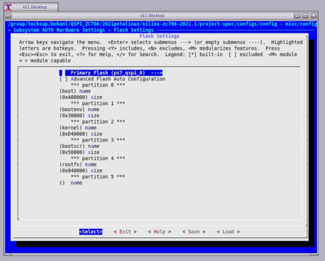
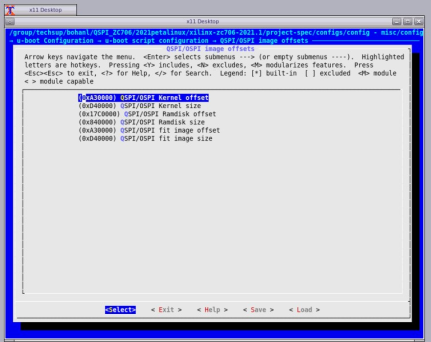

# zc706-QSPI-boot-image
How to boot QSPI images on a ZCU706 board using U-Boot distro boot

## **DESCRIPTION**
This Answer Record describes how to boot QSPI images on a ZCU706 board using U-Boot distro boot in 2021.1 of PetaLinux.

## **SOLUTION**
### 1. Create a PetaLinux project for a ZCU706 board using a template or BSP.

``` 
$ petalinux-create -t project -s <path_to_bsp>/xilinx-zc706-v2021.1-final.bsp
$ cd xilinx-zc706-2021.1

```
### 2. Configure the project with a QSPI partition.

If you cannot know the memory allocation in advance, you need to run the following command first, and allocate the flash space yourself according to the size of the project file of the build.

`$ petalinux-build`

Use petalinux-config to configure the flash space for each part of the files in images/linux/ in the project just generated.

File correspondence as following:  
The flash memory of the whole zc706 development board is 32MB
- **BOOT.bin** includes：

|Files     |                                                      Size  |
|:---:|:---:|
|zynq_fsbl.elf     |                                                      502KB  |
|Project_1.bit      |                                                     1.7MB  |
|u-boot.elf         |                                                     7.2MB  |
|system.dtb            |                                                  26KB   | 

So we allocate **10MB** to BOOT.bin  

- **bootenv** :no file correspondence but still need the size of **0.2MB**   
- **Boot.scr** ：boot.scr                                        **0.3MB**
- **Image** includes：image.ub                                           **13.25MB**  


|Flash Partition Name|Partion Address|Partition Size|  
|:---:|:---:|:---:|   
|0~0xA00000  |                                 10MB          |                 boot|  
|0xA00000~0xA30000 |                小于0.2MB(0x30000)     |     bootenv|  
|0xA30000~0x1770000  |              13.25MB(0xD40000)  |Image（kernel）|  
|0x1770000~0x 17C0000 |                 大于0.3MB(0x50000)      | bootscr|  


finish the following steps:  
`$ petalinux-config ---> Subsystem AUTO Hardware Settings---> Flash Settings`

**Attention**： Image is conresponding to kernel in the following image. The rootfs is useless in our project.


### 3. Configure u-boot according to your own file.   
```$ petalinux-config ---> u-boot Configuration ---> u-boot script configuration ---> QSPI/OSPI image offsets```

- **Kernel** corresponds to **image**  
- **Fit image** according to the kernel to match the same as the **kernel** 
- **Attention**：The Ramdisk is respond to the rootfs ,and the rootfs is useless in our project.We don't need to config it.



### 4.Configure the arm using the following steps  
`$ petalinux-config -c u-boot ---> ARM architecture ---> (0x1770000) Boot script offset`

### 5.Pack the files to boot.BIN  

`$ petalinux-build`  

```
$ petalinux-package --boot --force --format BIN --fsbl --u-boot --kernel --offset 0xA30000 --boot-script --offset 0x1770000 --file-attribute partition_owner=uboot
```
## **Program Flash**
We use the software"Xilinx Vitis 2022.2".And we programming QSPI Flash with the Flash Programming Tool.If you want to learn more,please read the reference[5].  
1. Power on the ZC702 board in JTAG boot mode (SW16 = 00000).  

2. Select **Xilinx** → **Program Flash** in the Vitis IDE.

3. Set the Image File to the **BOOT.bin** file and the Init File to **<your board>fsbl.elf**.

4. Set the Flash Type to **qspi-x4-single**.

5. Enable **Blank Check after Erase** and **Verify after flash**.

6. Select **Program**.

## **Result log**
  
## **REFERENCE**
[1]PetaLinux Tools Documentation: Reference Guide (UG1144) （https://docs.xilinx.com/r/en-US/ug1144-petalinux-tools-reference-guide/Steps-to-Boot-a-PetaLinux-Image-on-Hardware-with-QSPI-or-OSPI）  
[2]Zynq MPSoC - How to prepare a QSPI boot image to use with the default boot.scr method with PetaLinux(https://support.xilinx.com/s/article/1276990?language=en_US)  
[3]2020.x-2021.x and later PetaLinux: How to boot QSPI images on a ZCU102 board using U-Boot distro boot(https://support.xilinx.com/s/article/000033588?language=en_US)   
[4]下载开发板bsp文件（https://xilinx-wiki.atlassian.net/wiki/spaces/A/pages/1884029195/2021.1+Release）  
[5]Program Flash in Example 10(https://xilinx.github.io/Embedded-Design-Tutorials/docs/2020.2/build/html/docs/Introduction/Zynq7000-EDT/7-linux-booting-debug.html)
 


